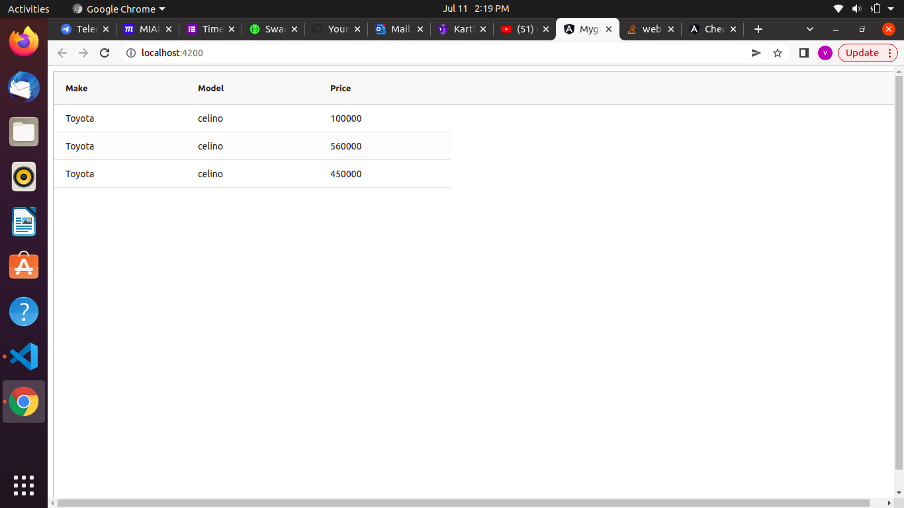
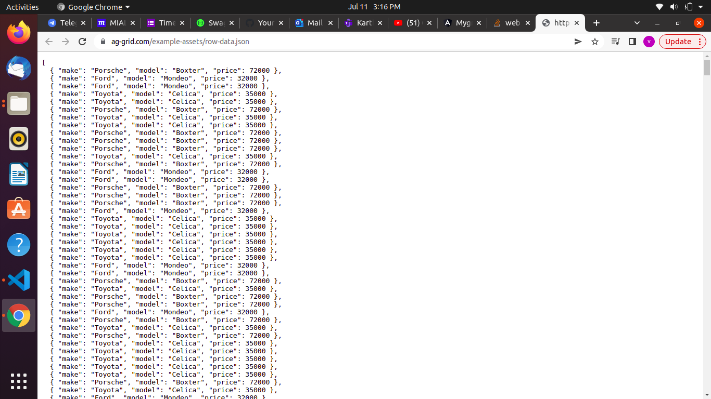
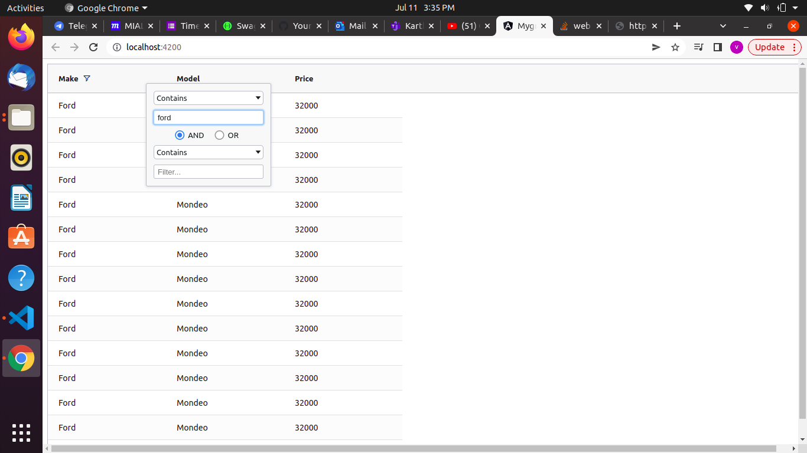
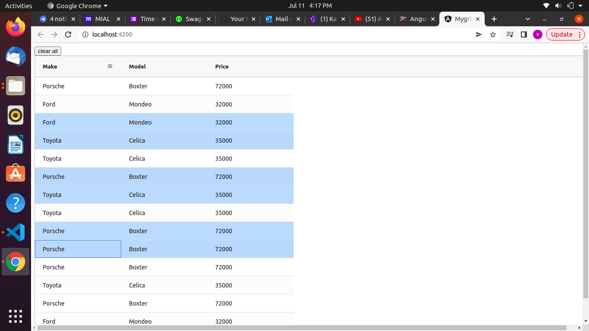
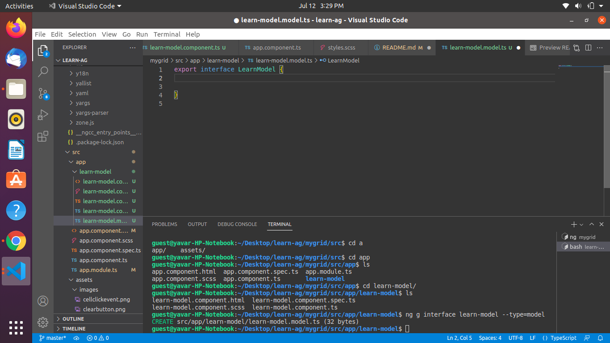
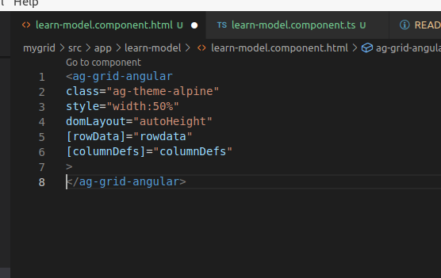
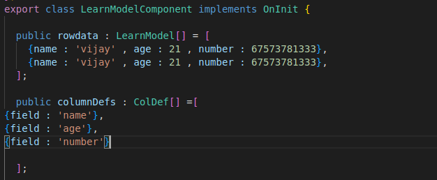
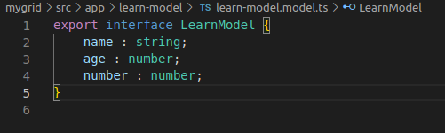
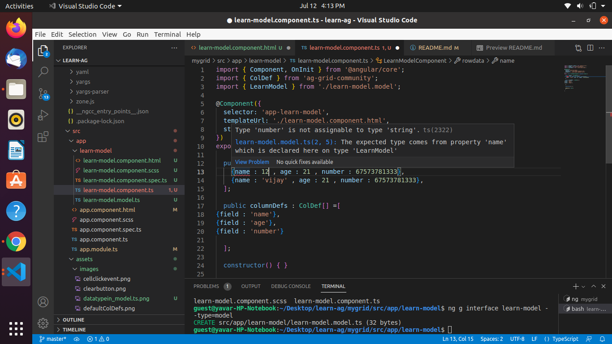

# Learning Angular ag-grid #

* <a href="https://youtu.be/_cRDVM6NlPk"> Click me to watch video </a>
* <a href="https://www.ag-grid.com/angular-data-grid/"> click me to visit the documentation </a>

## What is angular ag-grid? ##

 ### 

 * ag stands for Agnostic which means <b> independent of any framework. </b>
 * ag-Grid provides a feature to display the data in proper grid format with filtering and sorting features already included in it and many more. 
 * Ag-grid is a fully-featured and highly customizable javascript data grid. 
 * It is mainly used to display table data with rows and columns with datafilters.
 ###

## Advantages of Ag-grid ##

* Support for multiple frameworks with the same API.

* GUI layer tailored for each framework for the best developer experience and performance.

* Community Edition is completely free, even for commercial use.

* Our code is open source so you can review the code as part of your evaluation.

* Dedicated support team for Enterprise customers.

* Features no other Data Grid provides like pivoting, grouping, integrated charts.

## Step by Step proceudure to utilize ag-grid in angular project ##

### Step 1 : Create your angular project folder ###


<p> To Create any angular project , first create a folder and go inside the folder </p>

### Step 2 : Install angular cli ###


<p> Type the below command in terminaal to install angular cli </p>

```javascript
npm install -g @angular/cli  OR
npm i -g @angular/cli  OR
npm install @angular/cli@latest (To leatest version) OR
```
### Step 3 : Generate new project ###


<p> To generate new project we must type the below command to get all library files from angular </p>

```javascript
ng new app-name
```
* Output screenshot: 


### Step 4 : Run angular ###

<p> To run the angular project in your local host : 4200 port type below command  </p>

```javascript
ng serve  (A link will be generated , need to be open the page by clicking the link) OR
ng s OR
ng serve -o (To open directly in browser) OR
ng s -o
```
* Sample ScreenShots:


### Step 5 : Install ag-grid-community ###

<p> Instll the ag-grid community by following command </p>

```javascript
npm install ag-grid-community
```
### Step 6 : Install ag-grid-angular ###

<p> Instll the ag-grid-angular by following command </p>


```javascript
npm install ag-grid-angular
```
### Step 7 : Import AgGridModule app.module.ts file ###

<p> Import the AgGridModule in the module.ts file and also update the imported module in below declarations as follows: </p>

```javascript
import { NgModule } from '@angular/core';
import { BrowserModule } from '@angular/platform-browser';

import { AppComponent } from './app.component';
import { AgGridModule } from 'ag-grid-angular';

@NgModule({
  declarations: [
    AppComponent
  ],
  imports: [
    BrowserModule,
    AgGridModule
  ],
  providers: [],
  bootstrap: [AppComponent]
})
export class AppModule { }

```

### Step 8 : import the styles for ag-grid in style.css  ###

<p> To display the ag-grid in dispay we shoul import the styles in style.css as below:</p>

```javascript

@import "ag-grid-community/dist/styles/ag-grid.css";
@import "ag-grid-community/dist/styles/ag-theme-alpine.css";

```

### Step 9 : Use the grid module in app.component.html ###
<p> Bind the ag-rid module in html as follows </p>

```javascript

<ag-grid-angular
class="ag-theme-alpine"
style="height:100vh;width:100vw"
[rowData]="rowData"
[columnDefs]="colDefs"
>
<ag-grid-angular>

```

<p> NOTE : here , class and mentioning width and height is maditory to show the grid data in browser </p>

### Step 9 : pass the values for row and columns in app.component.ts ###

<p> To get the values for the html attribute , we must pass those inapp.component.ts file according to the variables as below:  </p>

```javascript
import { Component } from '@angular/core';
import { ColDef } from 'ag-grid-community';

@Component({
  selector: 'app-root',
  templateUrl: './app.component.html',
  styleUrls: ['./app.component.scss']
})
export class AppComponent {
  rowData : any[] =[
    {make : 'Toyota' , model : 'celino' , price :100000},
    {make : 'Toyota' , model : 'celino' , price :560000},
    {make : 'Toyota' , model : 'celino' , price :450000},

  ];
  colDefs : ColDef[] =[
    {field : 'make'},
    {field : 'model'},
    {field : 'price'},
    
    
  ];

}

```

### Output : ###



# Obtaining the row data from api using http #

###  Step 1 : import HttpClientModule ###

<p> First import the HttpClientModule  in app.module.ts file </p>

```javascript
...
import { HttpClientModule } from '@angular/common/http';
...
```
<p> Attach the imported module in the imports in same app.module.ts as below: </p>

```javascript
...
 imports: [
    BrowserModule,
    AgGridModule,
    HttpClientModule
  ],...
```

###  Step 2 : Get the row data with observable ###

<p> In app.component.ts , make the rowdata variable to rowdata$ with the type observable <any[] ></p>

```javascript

  rowData$!: Observable<any[]>;

```

### Step 3 : add http  in constrctor ###

```javascript

constructor(private http: HttpClient){ }

```
### Step 4 : add ngOnInit method to get row data from an hardcoded data using the link ###
<p> Initialize the ngOnInit metho in the export class itself as below:
</p>

```javascript

export class AppComponent implements OnInit {
  ...
}
```
<p>Define the ngOnit method like below using the get method with prviding the URL of the row data  
</p>

```javascript

ngOnInit(){
this.rowData$ = this.http.get<any[]>('https://www.ag-grid.com/example-assets/row-data.json')
}

```

### Step : 5 Change the variable name in app.component.html ###

<p> use the async method to bind the observable array with URL </p>

```javascript
[rowData]="rowData$ | async"
```
### Sample screen after obtaing the row data from hardadta URL ###


<a href="https://www.ag-grid.com/example-assets/row-data.json">Here is the URL lINK</a>

### ScreenShot of URL data ###



# Sorting and filtering for every columns #

* It is very easy to achive by adding sortable  and filter values set to be TRUE in app.component.ts file within the columDefs as below:

```javascript
  colDefs : ColDef[] =[
    {field : 'make' , sortable:true , filter:true },
    {field : 'model', sortable:true , filter:true },
    {field : 'price', sortable:true , filter:true },
    ];
```
* It can be achieved by other method as below :
adding defaultColDef in htlm and ive the vlues for them in ts file:

```javascript
...
[defaultColDef]="defaultColDef"
...
```
```javascript
colDefs : ColDef[] =[
    {field : 'make' ,  },
    {field : 'model',},
    {field : 'price',  },
    ];
    defaultColDef : ColDef = {
      sortable:true , filter:true
    }
```

* Output ScreenShot: 


* We can select the multiple rows and animate them with sorting by adding attribute in htlm as below:

```javascript
...
[rowSelection]="'multiple'"
[animateRows]="true"
...
```

# grid events #

* There are lot of events available in grid . Here we just try a simple event to console something by click is heppend by a user in any cell.

* We must bind the event in the html as follows :

```javascript
(cellClicked)="onCellClicked($event)"

```

* After that , we must define the event in .ts file . Here we just dispay the events in console.

```javascript

onCellClicked(event : CellClickedEvent){
  console.log(event);
}
```

* Output Screenshot:


# Utilizing api #

* There are lot of methods to use. Here i have shared a simple @viewchld method in ts as follows:

```javascript
@ViewChild(AgGridAngular) agGrid!: AgGridAngular;
```

* To make use of this , i have created a clearall button to deselect all the selected rows from api as with below method:

```javascript
clearselection(){
  this.agGrid.api.deselectAll();
}
```
* Finaly add a button in html and bind the clearselection method in it.

```javascript

<button (click) = "clearselection()"> clear all </button>
...
```

* Output:



#  Other important conceptsin  ag-grid #

## domLayout ##
* domLayout is an attribute which can be useg in ag-grid componenet with the any of following three values as follows:
  * domlayout = "normal"     --> It displays the normal grid.
  * domlayout = "autoHeight" --> It adjustes the rows and provide scroll bar.
  * domlayout = "print"      --> No scroll bars provided.

# model.ts file in angular #

* In simple words , it helps to define data types in seperate folder.

* models in angular is used to store the data.

* Mostly it deponds on two different types as 
    1  --> interface 
    2  --> classes

* The reason to use models in application is  <b> to validate the data type </b> of an typical data strctures like objects or table data.


* We can export the model interface files and can be obtained whereever we need in our application by importing it.

## generating model using angular cli ##

* We must use the below command in required directory .

```javascript 

ng g interface modelFileName --type=model

```

* Example :

```javascript
ng g interface learn-model --type=model
```
* Output :



* We may create class also that belongs to the user's requirement.

```javascript
Example :
ng g class learn-model --type=model
```
* NOTE :  We can do this mannaly without generating angular cli .

## Utilizing the generated model in  reqired component ##

* Mostly , we will use this model for row data attribute in ag-grid .

* So , let's take an simple component to display the row data.

### Step : 1  .html ###

* Assign [rowData] and  [columnDefs] in ag-grid.



### Step : 2 bind in .ts file ###

* First of all , assign the variable with public keyword and assign it to the interface name with [] and with the ow data .




* Kindly import the inteface in the .ts to utilize the interface for validatio of similar datatype.


### Step : 3 assigning type of data in model.ts file ###

* Just need to assign the row data values to correct datatype reqired like number,boolean and etc.



### Sample screen if any type of data is mismatch interface  ###

* The purpose of model interface is to omit unwanted errors in application as it is very large program.

 * It will show error if the data is mismatches with the intrface datatypes.

 